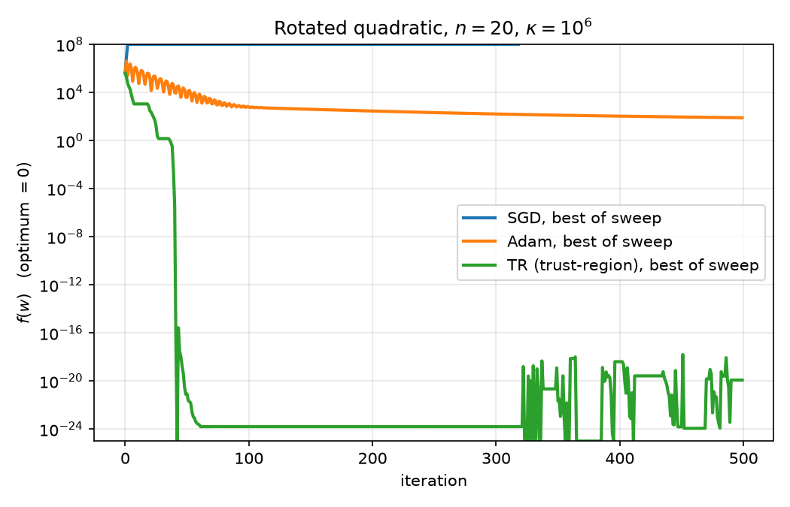
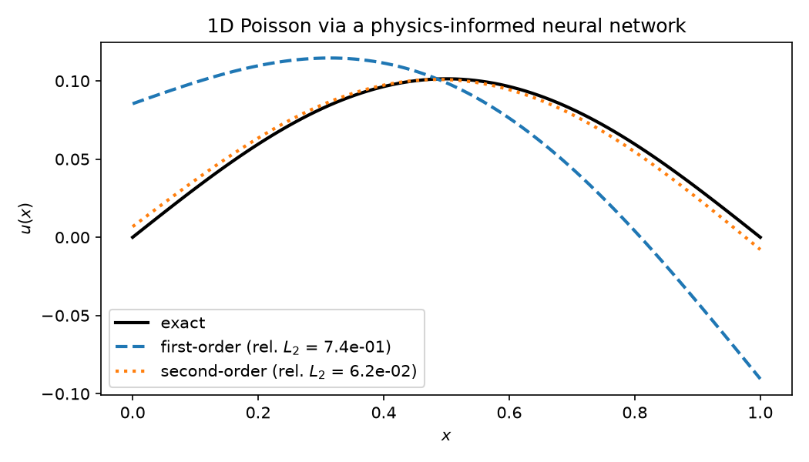

# DD4ML

[](https://github.com/cruzas/DD4ML/actions/workflows/ci.yml)
[](LICENSE)
[](pyproject.toml)
[](https://github.com/astral-sh/ruff)

**Domain decomposition methods for machine learning.**

DD4ML brings domain decomposition — a family of techniques developed for solving
large PDEs in parallel — to neural network training. Instead of the usual
first-order, globally synchronized update, the network is partitioned into
subdomains that are optimized locally and recombined through an additively
preconditioned, globally convergent trust-region method. Local steps use
limited-memory second-order models, so curvature information is exploited
without ever forming a Hessian.

In practice this means a training loop that is parallel by construction, has a
principled acceptance test for every step rather than a hand-tuned learning
rate, and applies equally to standard supervised learning and to
physics-informed neural networks (PINNs). The methods are described in the
[publications](#publications) below.

The code uses minGPT and builds from it: https://github.com/karpathy/minGPT/tree/master

## Installation
```bash
git clone https://github.com/cruzas/DD4ML.git
cd DD4ML
python3 -m pip install -e .          # editable, for development
python3 -m pip install .             # plain install
```

### CUDA support
For ***GPU support***, install the appropriate CUDA-enabled version of PyTorch before installing this package. For example, to install PyTorch with CUDA 12.4:
```bash
pip install torch torchvision torchaudio --index-url https://download.pytorch.org/whl/cu124
```

## Quickstart
No Docker, no wandb, no cluster — this runs in a few seconds and scores every
method against a known optimum:

```bash
python3 experiments/examples/quickstart.py
```

It minimizes a convex quadratic `f(w) = ½(w − w*)ᵀA(w − w*)` with condition
number 10⁶, where `f(w*) = 0` exactly, so results are measured against the truth
rather than against a loss curve. Both baselines get a learning-rate sweep and
are scored at their best, so nothing hinges on a badly chosen step size.

`SGD` and `Adam` are the `torch.optim` implementations; **`TR` is this
library's trust-region method**, with a limited-memory SR1 model of the
curvature.

```
  1. Does the ill-conditioning align with the coordinate axes?
     Hessian                         SGD       Adam           TR
     diagonal                        inf   2.45e-18     5.91e-19
     rotated                         inf   7.83e+01     1.19e-20

  2. Does the SR1 memory capture the curvature? (rotated problem)
     SR1 memory                 final f(w)
     5                            1.44e+02
     10                           2.08e+01
     20                           1.19e-20  <- memory = n, SR1 is exact for a quadratic
```



Two conditions decide the outcome, and together they say when these optimizers
are worth reaching for. **First**, whether the ill-conditioning is
coordinate-aligned: Adam reaches machine precision on the diagonal problem,
because its per-parameter scaling *is* a diagonal preconditioner — that is its
best case, not a hard one. Rotating the same spectrum leaves the condition
number untouched but no per-coordinate rescaling can undo it, and Adam stalls
twenty orders of magnitude short while the trust-region method is unaffected.
**Second**, whether the limited-memory SR1 model has enough curvature pairs:
with `n` pairs it reproduces the Hessian of an `n`-dimensional quadratic
exactly, and the trust-region step becomes a Newton step.

### A physics-informed neural network

The same reasoning says where these methods do *not* dominate. On a large
network with a well-conditioned loss and memory far below the parameter count,
a cheap diagonal preconditioner is hard to beat.

```bash
python3 experiments/examples/pinn_poisson_exact.py
```

This solves `-u''(x) = sin(pi x)` on `(0, 1)` with `u(0) = u(1) = 0` using a
physics-informed neural network. The exact solution `u(x) = sin(πx)/π²` is
known, so the script reports the **relative L2 error against the truth** rather
than a training loss:

```
  first-order   relative L2 error 7.417e-01   residual loss 2.34e-04   2.5s
  second-order  relative L2 error 6.214e-02   residual loss 2.59e-05   8.3s

  second-order is 11.9x more accurate for the same budget
```



The second-order method is 2× to 20× more accurate here depending on the seed —
a real gain, but nothing like the margin on the rotated quadratic above. In the
plot the first-order result visibly fails to satisfy the boundary conditions,
while the second-order curve tracks the exact solution. Well-tuned Adam is
competitive on this problem, which is exactly what the two conditions above
predict.

## Usage
In a ***local*** environment (e.g. PC), for example, you can run:
```bash
open -a Docker
wandb server start
python3 ./experiments/run_config_file.py --sweep_config="./experiments/config_files/<config_file>.yaml"
```
See `experiments/config_files/` for the available configurations. The code works
with or without wandb; if you want it, install wandb and see
[Troubleshooting](#troubleshooting) for first-time login.

In a ***cluster*** environment, e.g. managed by SLURM, you can run:
```bash
cd experiments
./submit_jobs.sh --config <config_name>
```
`<config_name>` must match a file in `experiments/job_configs/` (without the `.conf` extension); it defines the optimizers, datasets, models and sweep parameters for the job. `submit_jobs.sh` and `submit_jobs_common.sh` take care of the job name, wandb usage, and picking the right cluster job template (`rosa.job` or `daintalps.job`, selected automatically based on the environment) — there's nothing to edit by hand. Change the time/number of GPUs/etc. directly in the relevant `.conf` file or job template if needed.

Cluster runs also need three files in your home directory on the cluster:
`~/.tests_runpath` (defining `TESTS_RUNPATH`, the absolute path to this repo's
`experiments/` directory), `~/.slurm_env` (defining `SLURM_ACCOUNT`, daint-alps
only) and `~/.wandb_env` (wandb credentials, sourced only when wandb is
enabled). `TESTS_RUNPATH` is a legacy name from when these scripts lived under
`tests/` — it must point at `experiments/`. See
[experiments/README.md](experiments/README.md) for the details and for how to
switch to `EXPERIMENTS_RUNPATH` instead.

Two things to keep in mind:
- The ```Factory``` class defined in ```src/dd4ml/utility/factory.py``` allows you to dynamically add new classes, datasets, etc.
- Ensure that the configured ```batch_size``` is at least the number of processes (```world_size```). If it is smaller, each process defaults to a per-process batch size of 1.

## Structure
This library is meant to be general.

The repository is laid out as follows:
- `src/dd4ml` — the installable library
- `tests` — the pytest suite, and nothing else
- `experiments` — run configurations, SLURM job templates, sweep submission scripts and analysis helpers
- `plotting` — figure and table generation

The src folder is structured as follows:
- datasets (for processing data in rawdata)
- models
- optimizers
- pmw
- utility

You can extend the library by adding your own files in any of these modules. If you create a new folder within them, make sure to add an ```__init__.py``` file and then re-run ```python3 -m pip install .```, or ```python3 -m pip install --force-reinstall .``` if necessary.

## Development
```bash
python3 -m pip install -e ".[dev]"   # test + lint tooling
pre-commit install                   # run the hooks on every commit

pytest                               # the full suite
pytest -m "not slow"                 # skip the slower checks
ruff check . && ruff format --check .
```

Every push and pull request runs three CI jobs: lint and formatting, the test
suite across Python 3.10, 3.11 and 3.12 on CPU-only PyTorch, and a packaging
build that rejects a wheel large enough to mean dataset files have leaked in.

The suite is written to check numerical behaviour, not just that code runs. The
optimizers are verified against the acceptance ratios and trust-region updates
as published, using problems with closed-form solutions; the trust-region
subproblem solver is compared against an exact dense solve over randomised
problems, including the rank-deficient and degenerate cases; and buffer dtypes
are pinned in both directions so a float64 model is never silently truncated to
float32. A separate check imports every module in isolation, which is the only
way to catch a circular import that the usual entry points happen to mask.

That effort is concentrated where correctness is hardest to eyeball: the
optimizers and the trust-region subproblem solver sit at 73% line coverage
(46% across the package as a whole). Most of the remainder is the model-parallel
layer, which needs a multi-rank distributed job and so cannot execute on a
single-process CI runner.

## Troubleshooting
In case it's necessary, you may need to run the following:
```bash
python3 -m pip install --force-reinstall .
```
Based on your Python environment, you may need to also clear out the site-packages directory. You can find it by using the following command:
```bash
python3 -m site
```

Before using wandb locally on your computer, you need to make an account. Then, you can run the following command:
```bash
wandb login --relogin --host=http://127.0.0.1
```
You will need your API key: https://wandb.ai/authorize
Once you have done this, your credentials are saved. For more information, please consult: https://docs.wandb.ai/quickstart/

## Publications
The methods implemented here are described in the following papers:

* K. Trotti, S. A. Cruz Alegría, A. Kopaničáková, R. Krause.
  **Parallel trust-region approaches in neural network training.**
  *Proceedings of the MATH+ Thematic Einstein Semester*, 107–120, 2023.
* S. A. Cruz Alegría, K. Trotti, A. Kopaničáková, R. Krause.
  **Data-parallel neural network training via nonlinearly preconditioned
  trust-region method.**
  *Numerical Mathematics and Advanced Applications ENUMATH 2023*, Volume 1,
  34–43, 2025.
* S. Cruz Alegría, B. Çapriqi, S. Likaj, K. Trotti, R. Krause.
  **An additively preconditioned trust region strategy for machine learning.**
  *arXiv preprint* [arXiv:2512.14286](https://arxiv.org/abs/2512.14286), 2025.
  Submitted for review.

## Authors
* Dr. Samuel A. Cruz Alegría (1, 3); cruzas@usi.ch
* Dr. Ken Trotti (2); ken.trotti@usi.ch
* Marc Salvadó Benasco (1, 3, 4); marc.salvado@usi.ch
* Shega Likaj (1, 2, 3); shega.likaj@usi.ch
* Bindi Çapriqi (1, 2, 3); bindi.capriqi@kaust.edu.sa
* Armando Maria Monforte (3, 5); armandomaria.monforte01@universitadipavia.it
* Prof. Dr. Rolf Krause (2, 3); rolf.krause@kaust.edu.sa

## Maintainers
The library is developed and maintained by Dr. Samuel A. Cruz Alegría and
Dr. Ken Trotti.

## Collaborators
* Prof. Dr. Alena Kopaničáková (6)

## Universities
1. Università della Svizzera italiana
2. King Abdullah University of Science and Technology (KAUST)
3. UniDistance Suisse
4. Universitat Politècnica de Catalunya (UPC)
5. University of Pavia
6. Université de Genève

## Funding
This work was initially supported by the Swiss Platform for Advanced Scientific Computing (PASC) project **ExaTrain** (funding periods 2017-2021 and 2021-2024) and by the Swiss National Science Foundation through the projects "ML<sup>2</sup> -- Multilevel and Domain Decomposition Methods for Machine Learning" (197041) and "Multilevel training of DeepONets -- multiscale and multiphysics applications" (206745).
